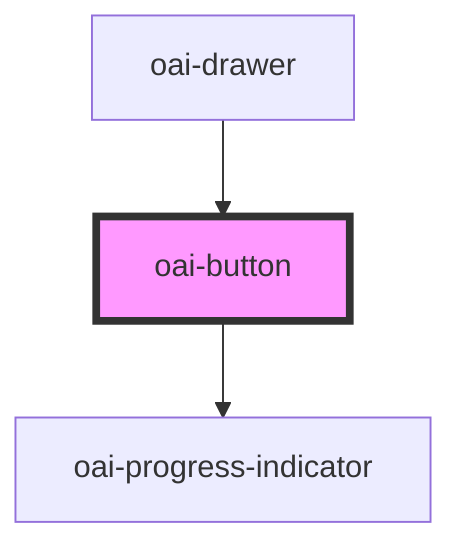

# oai-button

<!-- Auto Generated Below -->

## Properties

| Property | Attribute | Description                                                                                                                                                                                               | Type                                                   | Default     |
| -------- | --------- | --------------------------------------------------------------------------------------------------------------------------------------------------------------------------------------------------------- | ------------------------------------------------------ | ----------- |
| `color`  | `color`   |                                                                                                                                                                                                           | `"accent" \| "error" \| "pale" \| "primary" \| "warn"` | `'primary'` |
| `state`  | `state`   | (optional) The minimum size of the button (xs / sm / lg / xl) (optional) The type of the button (default = filled / outlined (stroked)) (optional) The state of the button (default / disabled / pending) | `"default" \| "disabled" \| "pending"`                 | `'default'` |

## Dependencies

### Used by

 - [oai-drawer](../drawer)

### Depends on

- [oai-progress-indicator](../progress-indicator)

### Graph

----------------------------------------------

*Built with [StencilJS](https://stenciljs.com/)*
