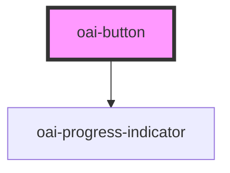

# oai-button

<!-- Auto Generated Below -->

## Properties

| Property   | Attribute  | Description                                                                                                                                                                                                                                                                               | Type                                   | Default     |
| ---------- | ---------- | ----------------------------------------------------------------------------------------------------------------------------------------------------------------------------------------------------------------------------------------------------------------------------------------- | -------------------------------------- | ----------- |
| `color`    | `color`    | (optional) The color of the button (pale / primary (default) / accent / error / warn)                                                                                                                                                                                                     | `string \| undefined`                  | `undefined` |
| `download` | `download` | This attribute instructs browsers to download a URL instead of navigating to it, so the user will be prompted to save it as a local file. If the attribute has a value, it is used as the pre-filled file name in the Save prompt (the user can still change the file name if they want). | `string \| undefined`                  | `undefined` |
| `href`     | `href`     | Contains a URL or a URL fragment that the hyperlink points to. If this property is set, an anchor tag will be rendered.                                                                                                                                                                   | `string \| undefined`                  | `undefined` |
| `rel`      | `rel`      | Specifies the relationship of the target object to the link object. The value is a space-separated list of [link types](https://developer.mozilla.org/en-US/docs/Web/HTML/Link_types).                                                                                                    | `string \| undefined`                  | `undefined` |
| `state`    | `state`    | (optional) The minimum size of the button (xs / sm / lg / xl) (optional) The type of the button (default = filled / outlined (stroked)) (optional) The state of the button (disabled / pending / undefined = default)                                                                     | `"disabled" \| "pending" \| undefined` | `undefined` |
| `target`   | `target`   | Specifies where to display the linked URL. Only applies when an `href` is provided. Special keywords: `"_blank"`, `"_self"`, `"_parent"`, `"_top"`.                                                                                                                                       | `string \| undefined`                  | `undefined` |

## CSS Custom Properties

| Name                   | Description                                 |
| ---------------------- | ------------------------------------------- |
| `--button-size-inline` | Minimum inline size (width) of the button   |
| `--contrast`           | Contrast (usually text) color of the button |
| `--theme`              | Theme color of the button                   |

## Dependencies

### Depends on

- [oai-progress-indicator](../progress-indicator)

### Graph

----------------------------------------------

*Built with [StencilJS](https://stenciljs.com/)*
