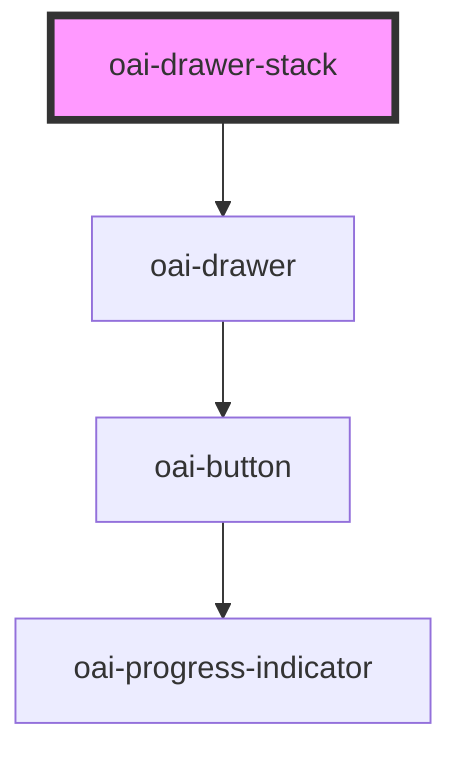

# oai-drawer-stack

<!-- Auto Generated Below -->

## Methods

### `pop() => Promise<void>`

#### Returns

Type: `Promise<void>`

### `push(html: string, config: { width: string; }) => Promise<void>`

#### Returns

Type: `Promise<void>`

## Dependencies

### Depends on

- [oai-drawer]()

### Graph

----------------------------------------------

*Built with [StencilJS](https://stenciljs.com/)*
