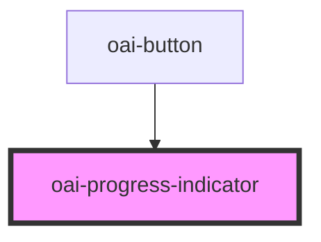

# oai-progress-indicator

<!-- Auto Generated Below -->

## Properties

| Property | Attribute | Description                                                                 | Type                                                   | Default  |
| -------- | --------- | --------------------------------------------------------------------------- | ------------------------------------------------------ | -------- |
| `color`  | `color`   |                                                                             | `"accent" \| "error" \| "pale" \| "primary" \| "warn"` | `'pale'` |
| `size`   | `size`    | (optional) The size of the progress indicator (xs (default) / sm / lg / xl) | `"lg" \| "sm" \| "xl" \| "xs"`                         | `'xs'`   |

## Dependencies

### Used by

 - [oai-button](../button)

### Graph

----------------------------------------------

*Built with [StencilJS](https://stenciljs.com/)*
