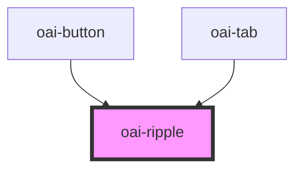

# oai-ripple

<!-- Auto Generated Below -->

## Properties

| Property          | Attribute | Description | Type          | Default     |
| ----------------- | --------- | ----------- | ------------- | ----------- |
| `el` _(required)_ | --        |             | `HTMLElement` | `undefined` |

## Dependencies

### Used by

 - [oai-button](../button)
 - [oai-tab](../tabs)

### Graph

----------------------------------------------

*Built with [StencilJS](https://stenciljs.com/)*
