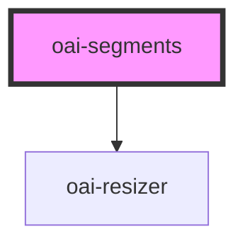

# oai-segments

<!-- Auto Generated Below -->

## Properties

| Property     | Attribute     | Description                                        | Type        | Default |
| ------------ | ------------- | -------------------------------------------------- | ----------- | ------- |
| `autoExpand` | `auto-expand` | (optional) auto expand selection (default = false) | `boolean`   | `true`  |
| `segments`   | --            |                                                    | `Segment[]` | `[]`    |

## Events

| Event          | Description | Type               |
| -------------- | ----------- | ------------------ |
| `textSelected` |             | `CustomEvent<any>` |

## Dependencies

### Depends on

- [oai-resizer]()

### Graph

----------------------------------------------

*Built with [StencilJS](https://stenciljs.com/)*
